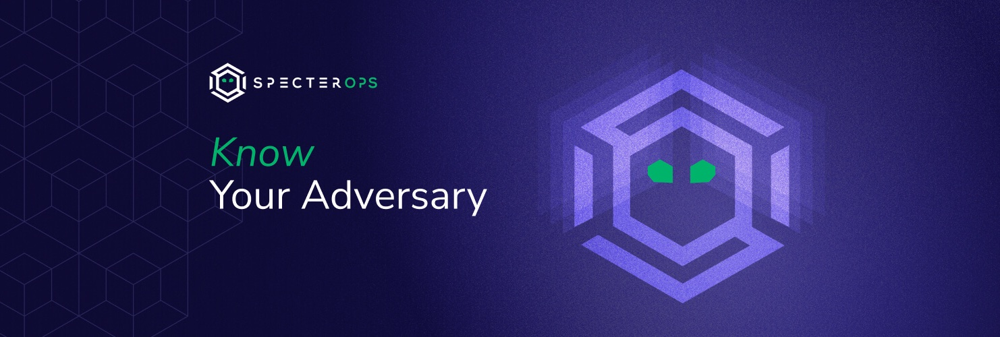

SpecterOps Organization Builder
===============================
  
  
  
    

Welcome! You're looking at the "secret" repository that builds the SpecterOps organization's profile page. You can view the output of this repository at [https://github.com/specterops](https://github.com/specterops).

Read on if you want to learn how it works:

# How it Works

This codebase can be run from a local system, but it is designed to be run by GitHub workflows. The workflows will run the code, and then commit the results to the `main` branch. That is what you see when you visit the main profile page.

The GitHub GraphQL API provides all the repository data for the projects.

## Initial Setup & Making Changes

The only file that should be modified to update the _README.md_ (that's the profile page) is the _config.yml_ file. This file controls which projects are shown on the page, and the order in which they are shown. It also controls details like the page title and introduction text.

The comments in the file explain how to use and update each section.

### Managing Projects

Follow the _config.yaml_ file's comments to add, remove, or adjust projects. There are a few important keys to note.

Under `projects`:

* `profile`: This is the name of the GitHub profile. Make sure it matches the name of the profile exactly.
* `org`: Flags the profile as an organization (not a personal profile). This is not used right now, but it is a placeholder for future features. Organizations are different from profiles in that they can have multiple owners and different details.

Under `featured`:

* `img`: This is the name of the image file that will be used for the project. The image file should be placed in the `img` directory. The image should be 320x320 pixels. The size is not critical, but it should be square and consistent across all images. 

## Kicking Off Updates

As mentioned above, GitHub workflows manage the updates. To kick off an update, push a commit to the `main` branch. The workflow will run, and then commit the results to the `main` branch. The details of the projects change frequently, so the workflows also run on a schedule to keep the page updated.

The workflows run `run.py` with the necessary commands to update the page. The `run.py` file is the main entry point for the code. The workflows run when:

* New changes are committed to the `main` branch
* The cron schedule is triggered (e.g., `0 18 * * 5` runs every Friday at 6pm)
* An admin triggers a manual run (under the _Actions_ tab on GitHub)
