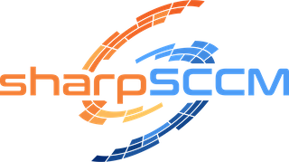
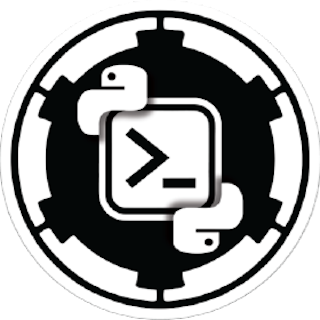

SpecterOps Open-Source Projects
===============================
  
  
  
    
  
At SpecterOps, we believe that we can influence our industry's maturation by contributing to the collective knowledge base. We do this by opening our ideas and hypotheses to inspection and criticism. That includes publishing our development works and contributing to the open-source community.

SpecterOps employees control their projects and maintain intellectual property rights and licenses, so most of the projects supported by SpecterOps are spread out over many individual GitHub profiles and organizations. We have organized these projects here for your perusal.

You can read more about our commitment to transparency here: [A Push Toward Transparency](https://posts.specterops.io/a-push-toward-transparency-c385a0dd1e34)  

# :fire: Featured Projects
  
The following projects are some larger open-source projects SpecterOps has, and continues to, sponsor and support. We hope you find them useful!  
  

Expand
  

## BloodHound
  
      

More Info
  
  
  
  
> BloodHound Community Edition uses graph theory to reveal the hidden and often unintended relationships within an Active Directory or Azure environment. Attackers can use BloodHound to easily identify highly complex attack paths that would otherwise be impossible to quickly identify. Defenders can use BloodHound to identify and eliminate those same attack paths. Both blue and red teams can use BloodHound to easily gain a deeper understanding of privilege relationships in an Active Directory or Azure environment.  

|Resource|Link|
| :--- | :--- |
|GitHub|<https://github.com/SpecterOps/BloodHound>|
|Homepage|<https://bloodhoundenterprise.io/>|
|Documentation|https://support.bloodhoundenterprise.io/|
  

  

## Nemesis
  
      

More Info
  
  
  
  
> Nemesis is a centralized data processing platform that ingests, enriches, and performs analytics on offensive security assessment data. It ingests data from a variety of sources (C2 frameworks, manual file uploads, Chrome downloads, etc.) and performs a number of automations and analytics on the collected data. It is a SpecterOps R&D project aiming to automate a number of repetitive tasks operators encounter on engagements, empower operators' analytic capabilities and collective knowledge, and create data stores of as much operational data as possible to help guide future research and facilitate offensive data analysis.  

|Resource|Link|
| :--- | :--- |
|GitHub|<https://github.com/SpecterOps/Nemesis>|
|Homepage|<https://specterops.github.io/Nemesis/>|
  

  

## Ghostwriter
  
      

More Info
  
  
  
  
> Ghostwriter is a part of your team. It helps you manage clients, projects, reports, and infrastructure in one application. It does not replace some of the more common or traditional project management tools, such as CRMs. Still, it does consolidate all relevant project information in a way for users to easily curate every aspect of their projects.  

|Resource|Link|
| :--- | :--- |
|GitHub|<https://github.com/GhostManager/Ghostwriter>|
|Homepage|<https://ghostwriter.wiki>|
|Documentation|https://www.ghostwriter.wiki/|
  

  

## Mythic
  
      

More Info
  
  
  
  
> A cross-platform, post-exploit, red teaming framework built with python3, docker, docker-compose, and a web browser UI. It's designed to provide a collaborative and user friendly interface for operators, managers, and reporting throughout red teaming.  

|Resource|Link|
| :--- | :--- |
|GitHub|<https://github.com/its-a-feature/Mythic>|
|Documentation|https://docs.mythic-c2.net/|
  

  

## Merlin
  
      

More Info
  
  
  
  
> Merlin is a cross-platform post-exploitation Command & Control server and agent written in Go.  

|Resource|Link|
| :--- | :--- |
|GitHub|<https://github.com/Ne0nd0g/merlin>|
  

  

## CrucibleC2
  
      

More Info
  
  
  
  
> A C# Command & Control framework   

|Resource|Link|
| :--- | :--- |
|GitHub|<https://github.com/DragoQCC/CrucibleC2>|
  

  

## SharpSCCM
  
      

More Info
  
  
  
  
> SharpSCCM is a post-exploitation tool designed to leverage Microsoft Endpoint Configuration Manager (a.k.a. ConfigMgr, formerly SCCM) for lateral movement and credential gathering without requiring access to the SCCM administration console GUI.  

|Resource|Link|
| :--- | :--- |
|GitHub|<https://github.com/Mayyhem/SharpSCCM>|
  

  

## Misconfiguration Manager
  
      

More Info
  
  
  
  
> Misconfiguration Manager is a central knowledge base for all known Microsoft Configuration Manager tradecraft and associated defensive and hardening guidance.  

|Resource|Link|
| :--- | :--- |
|GitHub|<https://github.com/subat0mik/Misconfiguration-Manager>|
|Homepage|<https://misconfigurationmanager.com>|
  

  

## CS2ModRewrite
  
      

More Info
  
  
> This project converts a Cobalt Strike profile to a functional mod_rewrite .htaccess or Nginx config file to support HTTP reverse proxy redirection to a Cobalt Strike teamserver. The use of reverse proxies provides protection to backend C2 servers from profiling, investigation, and general internet background radiation.  

|Resource|Link|
| :--- | :--- |
|GitHub|<https://github.com/threatexpress/cs2modrewrite>|
  

  

## Malleable C2
  
      

More Info
  
  
> Cobalt Strike Malleable C2 Design and Reference Guide  

|Resource|Link|
| :--- | :--- |
|GitHub|<https://github.com/threatexpress/malleable-c2>|
  

  

## SharpRDP
  
      

More Info
  
  
> Remote Desktop Protocol .NET Console Application for Authenticated Command Execution  

|Resource|Link|
| :--- | :--- |
|GitHub|<https://github.com/0xthirteen/SharpRDP>|
  

  

## StayKit
  
      

More Info
  
  
> Cobalt Strike kit for Persistence  

|Resource|Link|
| :--- | :--- |
|GitHub|<https://github.com/0xthirteen/StayKit>|
  

  

## Covenant
  
      

More Info
  
  
  
  
> Covenant is a .NET command and control framework that aims to highlight the attack surface of .NET, make the use of offensive .NET tradecraft easier, and serve as a collaborative command and control platform for red teamers.  

|Resource|Link|
| :--- | :--- |
|GitHub|<https://github.com/cobbr/Covenant>|
|Homepage|<https://cobbr.io/Covenant.html>|
|Documentation|https://github.com/cobbr/Covenant/wiki|
  

  

## SharpSploit
  
      

More Info
  
  
> SharpSploit is a .NET post-exploitation library written in C# that aims to highlight the attack surface of .NET and make the use of offensive .NET easier for red teamers.  

|Resource|Link|
| :--- | :--- |
|GitHub|<https://github.com/cobbr/SharpSploit>|
|Homepage|<https://sharpsploit.cobbr.io/api/>|
  

  

## PowerSploit (Retired)
  
      

More Info
  
  
> PowerSploit - A PowerShell Post-Exploitation Framework  

|Resource|Link|
| :--- | :--- |
|GitHub|<https://github.com/PowerShellMafia/PowerSploit>|
  

  

## Empire (Retired)
  
      

More Info
  
  
  
  
> Empire is a post-exploitation framework with a pure-PowerShell 2.0 Windows agent and a pure Python 2.6/2.7 Linux/OS X agent. It is the merge of the previous PowerShell Empire and Python EmPyre projects. The framework offers cryptological-secure communications and a flexible architecture. On the PowerShell side, Empire implements the ability to run PowerShell agents without needing powershell.exe, rapidly deployable post-exploitation modules ranging from key loggers to Mimikatz, and adaptable communications to evade network detection, all wrapped up in a usability-focused framework. PowerShell Empire premiered at BSidesLV in 2015, and Python EmPyre premiered at HackMiami in 2016.  
>   
> The project was retired in 2019, but the code is still available for reference. You can learn more about the end of the project here: <https://mobile.twitter.com/specterops/status/1156650932421050368>  

|Resource|Link|
| :--- | :--- |
|GitHub|<https://github.com/EmpireProject/Empire>|
|Homepage|<http://www.powershellempire.com/>|
  

  
  

  

# :purple_heart: Other Projects
  
  
SpecterOps employees have also created and contributed to many other projects, too numerous to list in detail here. These projects are listed below, sorted by the owner's profile.  
  

Expand
  
  
- [chrismaddalena/DocPatch](https://github.com/chrismaddalena/DocPatch)  
  - A simple script that edits the XML of a macro-enabled Word document (.docm or Word 97 document) to add a reference to a remote stylesheet.  
- [chrismaddalena/SharpCloud](https://github.com/chrismaddalena/SharpCloud)  
  - Simple C# for checking for the existence of credential files related to AWS, Microsoft Azure, and Google Compute.  
- [chrismaddalena/ODIN](https://github.com/chrismaddalena/ODIN)  
  - Automated network asset, email, and social media profile discovery and cataloguing.  
- [chrismaddalena/Cooper](https://github.com/chrismaddalena/Cooper)  
  - A Python tool for ingesting HTML and producing HTML source suitable for phishing campaigns.  
- [chrismaddalena/Goreport](https://github.com/chrismaddalena/Goreport)  
  - A Python script to collect campaign data from Gophish and generate a report  
- [its-a-feature/dylibHijackScanner](https://github.com/its-a-feature/dylibHijackScanner)  
  - Objective C dylibHijackScanner and analysis tool  
- [its-a-feature/Orchard](https://github.com/its-a-feature/Orchard)  
  - JavaScript for Automation (JXA) tool to do Active Directory enumeration.  
- [its-a-feature/bifrost](https://github.com/its-a-feature/bifrost)  
  - Objective-C library and console to interact with Heimdal APIs for macOS Kerberos  
- [hotnops/gtunnel](https://github.com/hotnops/gtunnel)  
  - A robust tunelling solution written in golang  
- [hotnops/AzureScripts](https://github.com/hotnops/AzureScripts)  
  - Random scripts for azure stuff  
- [hotnops/AWSRoleJuggler](https://github.com/hotnops/AWSRoleJuggler)  
  - A toolset to juggle AWS roles for persistent access  
- [hotnops/RemoteDebugView](https://github.com/hotnops/RemoteDebugView)  
  - A DLL that serves OutputDebugString content over a TCP connection  
- [hotnops/COM_Mapper](https://github.com/hotnops/COM_Mapper)  
  - A tool to create COM class/interface relationships in neo4j  
- [eladshamir/SharpElevator](https://github.com/eladshamir/SharpElevator)  
  - SharpElevator is a C# implementation of Elevator for UAC bypass.  This UAC bypass was originally discovered by James Forshaw and published in his brilliant post at: https://googleprojectzero.blogspot.com/2019/12/calling-local-windows-rpc-servers-from.html  
- [jaredcatkinson/PSReflect-Functions](https://github.com/jaredcatkinson/PSReflect-Functions)  
  - Module to provide PowerShell functions that abstract Win32 API functions  
- [jaredcatkinson/AbstractionMaps](https://github.com/jaredcatkinson/AbstractionMaps)  
- [jaredcatkinson/abstraction-workshop](https://github.com/jaredcatkinson/abstraction-workshop)  
- [leechristensen/SpoolSample](https://github.com/leechristensen/SpoolSample)  
  - PoC tool to coerce Windows hosts authenticate to other machines via the MS-RPRN RPC interface.  This is possible via other protocols as well.  
- [t94j0/satellite](https://github.com/t94j0/satellite)  
  - easy-to-use payload hosting  
- [t94j0/gophish-notifier](https://github.com/t94j0/gophish-notifier)  
  - Notification webhook for GoPhish  
- [cobbr/SharpGen](https://github.com/cobbr/SharpGen)  
  -  SharpGen is a .NET Core console application that utilizes the Rosyln C# compiler to quickly cross-compile .NET Framework console applications or libraries.  
- [cobbr/Elite](https://github.com/cobbr/Elite)  
  - Elite is the client-side component of the Covenant project. Covenant is a .NET command and control framework that aims to highlight the attack surface of .NET, make the use of offensive .NET tradecraft easier, and serve as a collaborative command and control platform for red teamers.  
- [cobbr/C2Bridge](https://github.com/cobbr/C2Bridge)  
  - C2Bridges allow developers to create new custom communication protocols and quickly utilize them within Covenant.  
- [0xthirteen/MoveKit](https://github.com/0xthirteen/MoveKit)  
  - Cobalt Strike kit for Lateral Movement  
- [0xthirteen/SharpStay](https://github.com/0xthirteen/SharpStay)  
  - .NET project for installing Persistence  
- [0xthirteen/SharpMove](https://github.com/0xthirteen/SharpMove)  
  - .NET Project for performing Authenticated Remote Execution  
- [IceMoonHSV/Sim](https://github.com/IceMoonHSV/Sim)  
  - C# User Simulation  
- [IceMoonHSV/PortScanner](https://github.com/IceMoonHSV/PortScanner)  
  - C# Port Scanner  
- [merrillmatt011/EntropyCapture](https://github.com/merrillmatt011/EntropyCapture)  
  - Simple Extraction of DPAPI pOptionalEntropy value using API Hooking  
- [Dcellular/GoPhish-Ansible-Setup](https://github.com/Dcellular/GoPhish-Ansible-Setup)  
- [Invoke-IR/ACE](https://github.com/Invoke-IR/ACE)  
  - Automated, Collection, and Enrichment Platform  
- [Invoke-IR/PowerForensics](https://github.com/Invoke-IR/PowerForensics)  
  - PowerForensics provides an all in one platform for live disk forensic analysis  
- [Invoke-IR/PowerForensicsPortable](https://github.com/Invoke-IR/PowerForensicsPortable)  
- [Invoke-IR/Uproot](https://github.com/Invoke-IR/Uproot)  
  - Currently not updated for WMIEvent module...  
- [BloodHoundAD/BARK](https://github.com/BloodHoundAD/BARK)  
  - BloodHound Attack Research Kit  
- [SpecterOps/AzureHound](https://github.com/SpecterOps/AzureHound)  
  - Azure Data Exporter for BloodHound  
- [SpecterOps/SharpHound](https://github.com/SpecterOps/SharpHound)  
  - C# Data Collector for BloodHound  
- [SpecterOps/SharpHoundCommon](https://github.com/SpecterOps/SharpHoundCommon)  
  - Common library used by SharpHound.   
- [SpecterOps/BloodHoundQueryLibrary](https://github.com/SpecterOps/BloodHoundQueryLibrary)  
  - A community-driven collection of BloodHound queries   
- [SpecterOps/DAWGS](https://github.com/SpecterOps/DAWGS)  
- [SpecterOps/MSSQLHound](https://github.com/SpecterOps/MSSQLHound)  
  - PowerShell collector for adding MSSQL attack paths to BloodHound with OpenGraph  
- [SpecterOps/1PassHound](https://github.com/SpecterOps/1PassHound)  
- [SpecterOps/GitHound](https://github.com/SpecterOps/GitHound)  
- [SpecterOps/SnowHound](https://github.com/SpecterOps/SnowHound)  
- [MythicAgents/apfell](https://github.com/MythicAgents/apfell)  
  - JavaScript for Automation (JXA) macOS agent  
- [MythicAgents/poseidon](https://github.com/MythicAgents/poseidon)  
  - Poseidon is a Golang agent targeting Linux and macOS  
- [MythicAgents/Apollo](https://github.com/MythicAgents/Apollo)  
  - A .NET Framework 4.0 Windows Agent  
- [MythicMeta/Mythic_CLI](https://github.com/MythicMeta/Mythic_CLI)  
  - Golang CLI binaries to replace the bash scripts controlling Mythic  
- [MythicMeta/MythicReactUI](https://github.com/MythicMeta/MythicReactUI)  
  - Source code for the React Mythic UI  
- [MythicMeta/Mythic_Scripting](https://github.com/MythicMeta/Mythic_Scripting)  
  - Mythic Scripting PyPi package - mythic  
- [GhostManager/mythic_sync](https://github.com/GhostManager/mythic_sync)  
  - Automated activity logging utility for Mythic C2 v3.0+ with Ghostwriter v3.0+  
- [threatexpress/domainhunter](https://github.com/threatexpress/domainhunter)  
  - Checks expired domains for categorization/reputation and Archive.org history to determine good candidates for phishing and C2 domain names  
- [GhostManager/Ghostwriter_CLI](https://github.com/GhostManager/Ghostwriter_CLI)  
  - Golang CLI binary used for installing and managing Ghostwriter  
- [GhostManager/cobalt_sync](https://github.com/GhostManager/cobalt_sync)  
  - Standalone Cobalt Strike operation logging Aggressor script for Ghostwriter 2.0+  
- [GhostPack/Rubeus](https://github.com/GhostPack/Rubeus)  
  - Trying to tame the three-headed dog.  
- [GhostPack/Seatbelt](https://github.com/GhostPack/Seatbelt)  
  - Seatbelt is a C# project that performs a number of security oriented host-survey "safety checks" relevant from both offensive and defensive security perspectives.  
- [GhostPack/SafetyKatz](https://github.com/GhostPack/SafetyKatz)  
  - SafetyKatz is a combination of slightly modified version of @gentilkiwi's Mimikatz project and @subtee's .NET PE Loader  
- [GhostPack/SharpUp](https://github.com/GhostPack/SharpUp)  
  - SharpUp is a C# port of various PowerUp functionality.  
- [GhostPack/KeeThief](https://github.com/GhostPack/KeeThief)  
  - Methods for attacking KeePass 2.X databases, including extracting of encryption key material from memory.  
- [GhostPack/Certify](https://github.com/GhostPack/Certify)  
  - Active Directory certificate abuse.  
- [GhostPack/SharpDPAPI](https://github.com/GhostPack/SharpDPAPI)  
  - SharpDPAPI is a C# port of some Mimikatz DPAPI functionality.  
- [GhostPack/Koh](https://github.com/GhostPack/Koh)  
  - The Token Stealer  
- [GhostPack/DeepPass](https://github.com/GhostPack/DeepPass)  
  - Hunting for passwords with deep learning  
- [GhostPack/Invoke-Evasion](https://github.com/GhostPack/Invoke-Evasion)  
  - PowerShell Obfuscation and Data Science  
- [GhostPack/PSPKIAudit](https://github.com/GhostPack/PSPKIAudit)  
  - PowerShell toolkit for AD CS auditing based on the PSPKI toolkit.  
- [GhostPack/ForgeCert](https://github.com/GhostPack/ForgeCert)  
  - "Golden" certificates  
- [GhostPack/RestrictedAdmin](https://github.com/GhostPack/RestrictedAdmin)  
  - Remotely enables Restricted Admin Mode  
- [GhostPack/Lockless](https://github.com/GhostPack/Lockless)  
  - Lockless allows for the copying of locked files.  
- [GhostPack/SharpWMI](https://github.com/GhostPack/SharpWMI)  
  - SharpWMI is a C# implementation of various WMI functionality.  
- [GhostPack/SharpRoast](https://github.com/GhostPack/SharpRoast)  
  - DEPRECATED SharpRoast is a C# port of various PowerView's Kerberoasting functionality.  
- [GhostPack/SharpDump](https://github.com/GhostPack/SharpDump)  
  - SharpDump is a C# port of PowerSploit's Out-Minidump.ps1 functionality.  
- [PowerShellMafia/PowerSCCM](https://github.com/PowerShellMafia/PowerSCCM)  
  - PowerSCCM - PowerShell module to interact with SCCM deployments  

  
